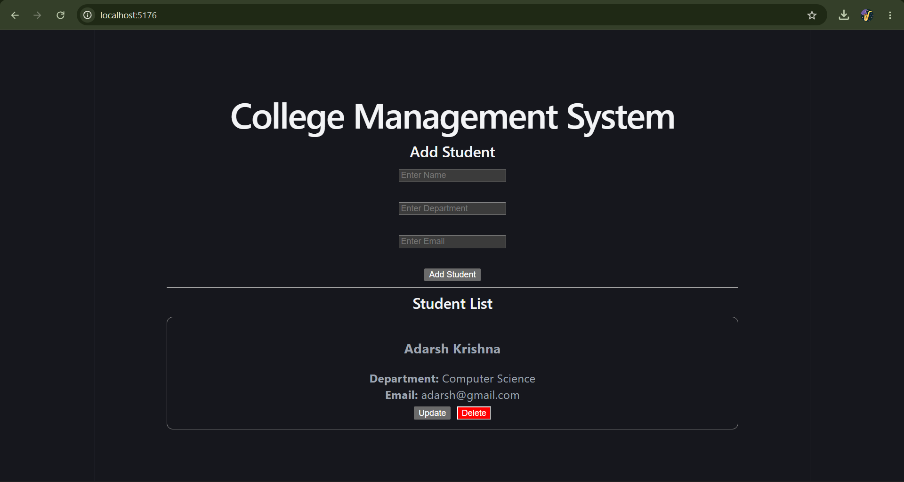
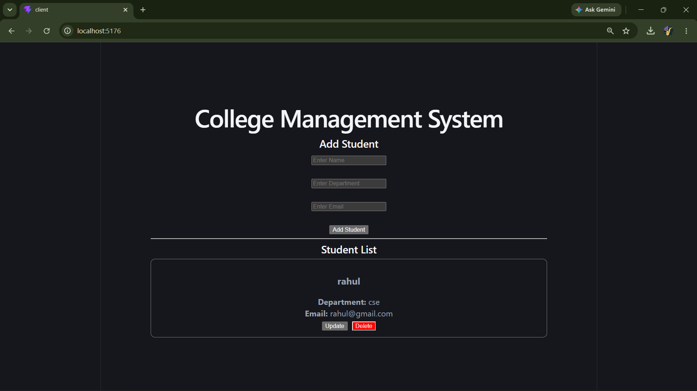
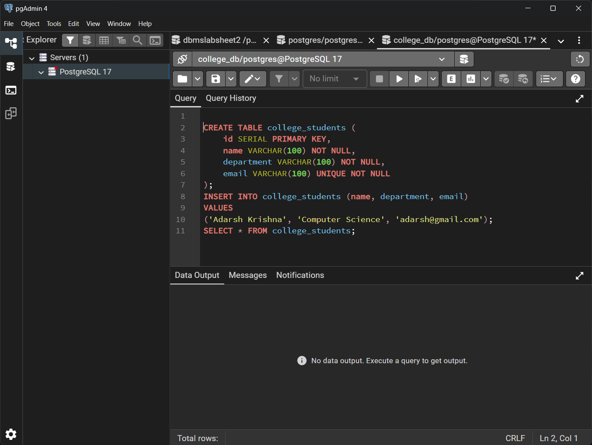
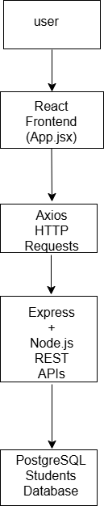

# College Management System (PERN Stack)

## Task Description

This project is a full-stack **College Management System** developed using the **PERN Stack (PostgreSQL, Express.js, React.js, and Node.js)**.

The application allows users to manage student records by performing complete **CRUD (Create, Read, Update, Delete)** operations through backend APIs.

---

## Technologies Used

- PostgreSQL
- Express.js
- React.js
- Node.js
- Axios
- CSS

---

## Features

- View all students
- Add a new student
- Update existing student details
- Delete a student
- Email validation before adding or updating
- REST API communication
- PostgreSQL database integration

---

## Project Structure

```text
PERN-Management-System/
│
├── client/
│   ├── src/
│   ├── public/
│   └── package.json
│
├── server/
│   ├── index.js
│   ├── db.js
│   └── package.json
│
├── screenshots/
│   ├── home.png
│   ├── add-student.png
│   ├── update.png
│   ├── delete.png
│   └── database.png
│
├── database.sql
└── README.md
```

---

## How I Implemented the Project

1. Created a PostgreSQL database.
2. Created a Students table to store student information.
3. Connected PostgreSQL with Node.js using the pg package.
4. Built REST APIs using Express.js.
5. Developed the frontend using React.js.
6. Used Axios to connect the frontend with backend APIs.
7. Implemented CRUD operations:
   - Create Student
   - Read Students
   - Update Student
   - Delete Student
8. Added email validation for student records.
9. Connected the frontend and backend successfully.
10. Uploaded the completed project to GitHub.

---

## What I Learned

- Basics of the PERN Stack
- Creating REST APIs using Express.js
- Connecting React with Node.js
- PostgreSQL database operations
- CRUD operations
- Axios for API communication
- React Hooks (useState and useEffect)
- Git and GitHub basics
- Form validation in React

---

## Screenshots

### Home Page



---

### Add Student



---

### Update Student


---

### Delete Student


---

### PostgreSQL Database



---

## Database

The project uses **PostgreSQL** as the database.

Table Name:

```
students
```

Columns:

| Column | Data Type |
|---------|-----------|
| id | SERIAL PRIMARY KEY |
| name | VARCHAR(100) |
| department | VARCHAR(100) |
| email | VARCHAR(100) |

---

## GitHub Repository

https://github.com/Adarsh-ak25/Recruitment

---

## Author

**Adarsh Krishna**
---

## Workflow Diagram

The following diagram shows how the application works:

